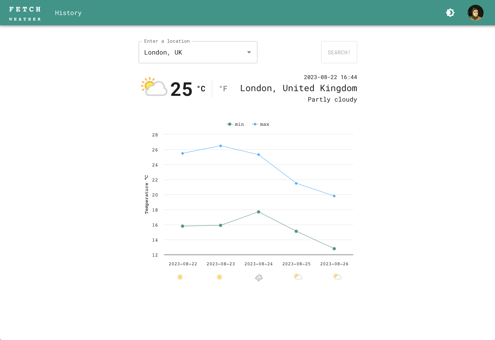
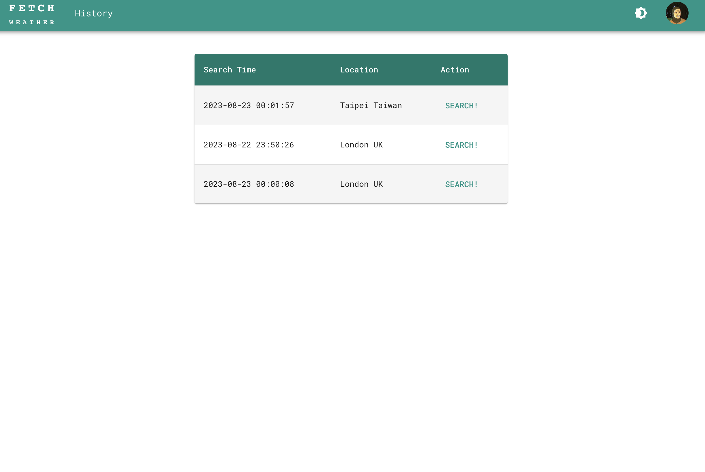

# Weather APP

A full responsive LightSplit clone made with TailwindCSS and Nextjs.

## Live Demo

[Here](https://weather-app-lime-rho.vercel.app/)

## Screenshots




## Tech Stack

- [Next.js](https://nextjs.org)
- [NextAuth.js](https://next-auth.js.org)
- [Material UI](https://mui.com/)

## Features

- Location Autocomplete
- History Table
- User Login
- Light/Dark Theme

## Getting Started

### Prerequisites

- node >=18.12.1
- yarn = 1.22.19

### Installation

```bash
# Clone the repo
git clone https://github.com/ericsen-tsai/weather-app

# Navigate into the project directory
cd weather-app

# Install dependencies
yarn install

# Start the development server
yarn run dev
```

### Build

```bash
# Build the project
yarn run build
```

### Deployment

This project is continuously deployed on [Vercel](https://vercel.com/).

## Contact

For more information or for any queries, feel free to reach out to me:

- [LinkedIn](https://www.linkedin.com/in/ericsen-tsai-a00948236/)
- [GitHub](https://github.com/ericsen-tsai)
- [GitLab](https://gitlab.com/ericsentsai)
- Email: <bommer95175@gmail.com>
